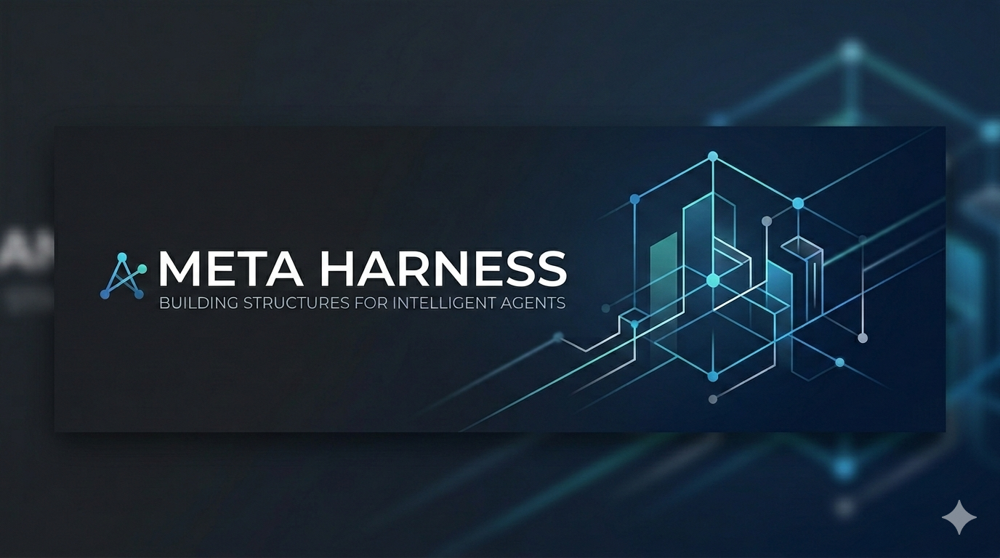

<p align="center">
  
</p>

<p align="center">
  <a href="LICENSE"></a>
  
</p>

# Meta Harness

Meta Harness is a portable, standards-first meta-skill for designing domain-specific workflows, reusable specialist skills, and deterministic handoff artifacts.

Current project version: `0.3`. See [Changelog](CHANGELOG.md) for checkpoint-based version history.

Adapted from [the original Harness project](https://github.com/revfactory/harness) and distributed here under the same [Apache 2.0](LICENSE) license.

## What This Adds

Compared to the original Claude Code-based Harness, this project adds:

- a standards-first repository layout built around `AGENTS.md`, `.agents/skills/`, and `docs/harness/`
- concise, human-written `AGENTS.md` guidance built around repo-wide `WHAT / WHY / HOW` plus progressive disclosure
- runtime-neutral artifact contracts based on skills, team specs, and deterministic `_workspace/` handoffs
- rippable harness design guidance that keeps temporary model-specific recovery logic easy to remove
- a repo-local bootstrap installer for project-level and user-level skill installs
- a tighter maintenance loop through repo-local validation and simpler, platform-independent conventions

## What It Includes

- a 6-phase workflow for analysis, architecture, generation, integration, and validation
- 6 architecture patterns: Pipeline, Fan-out/Fan-in, Expert Pool, Producer-Reviewer, Supervisor, and Hierarchical Delegation
- an autonomous experimentation workflow profile for user-controlled compute
- repo-local skills under `.agents/skills/`
- durable output specs under `docs/harness/`
- deterministic `_workspace/` handoff conventions
- a small bootstrap installer plus validation and smoke-test scripts

## Collaboration Model

- The Lead is the default orchestrator. It owns context, planning, work contracts, subAgent prompts, output contracts, synthesis, validation, and the final decision.
- For `$harness` or harness-style multi-agent requests, the default mode is approval-first: the Lead drafts the full plan, iterates with the user, and waits for explicit final approval before spawning subAgents or mutating target deliverables.
- When a task can be bounded, the Lead should delegate to a bounded implementer instead of directly editing implementation deliverables.
- Direct Lead writes are limited to explicit user authorization, non-delegable emergency unblockers, or final synthesis and handoff artifacts owned by the Lead; document any such exception in `_workspace/`.
- Keep a compact context pack in the Lead thread or top-level `_workspace/` handoff: goal, scope, source authority, active constraints, subAgent ids and roles, output paths, tests, blockers, and final decision state.
- A reusable plan should name `RequestMeaning`, `Assumptions`, `Architecture`, `FileOwnership`, `WavePlan`, `SpawnPlan`, `SpawnPrompts`, `TurnByTurnFeedback`, `ValidationPlan`, `FinalReviewCriteria`, and `ApprovalGate`.
- Spawn prompts are work contracts: they must include source authority, read/write boundaries, tool permissions, output paths, acceptance criteria, stop conditions, and reporting format.
- Avoid full-history forks with explicit model overrides; when a specific model is needed, use a compact handoff that carries only the required context.
- Use cheap and fast models for deterministic implementers after the patch is already decided.
- Use coding-optimized models for bounded code changes where the task is still implementation-heavy but narrow.
- Use frontier, high, or xhigh only for broad research, multi-source synthesis, governance or security review, architecture ambiguity, or cross-runtime reasoning.
- Researchers may use web, search, or scrapling only when current external information or multi-source evidence is actually needed.
- Reviewers should read the original request, the produced artifact, and the acceptance criteria, then produce a deterministic report.
- Keep runtime-specific orchestration and recovery logic out of the root docs unless the repository already depends on it; link to deeper docs instead. The detailed approval-first prompt contract lives in [docs/harness/README.md](docs/harness/README.md).

## Docs

- [Installation](docs/installation.md)
- [Compatibility Guides](docs/compatibility/README.md)
- [Sample Prompts](docs/sample-prompts.md)
- [Changelog](CHANGELOG.md)
- [Harness Output Specs](docs/harness/README.md)
- [Starter Research Example](docs/harness/starter-research/README.md)
- [AGENTS Authoring Guide](.agents/skills/harness/references/agents-md-guide.md)
- [Orchestrator Template](.agents/skills/harness/references/orchestrator-template.md)

## Repository Layout

```text
meta-harness/
├── AGENTS.md
├── .agents/skills/harness/
│   ├── SKILL.md
│   └── references/
├── docs/harness/README.md
├── docs/harness/starter-research/
├── scripts/install_harness.py
├── scripts/test_install_harness.py
├── scripts/validate_codex_port.py
└── LICENSE
```

## Install

Install into a project:

```shell
python3 scripts/install_harness.py --scope project --target /path/to/repo --layout standard
```

Install as a user-level shared skill:

```shell
python3 scripts/install_harness.py --scope user --layout standard
```

Use `--layout forgecode`, `--layout droid`, `--layout openhands`, or `--layout aider` when you want a client-specific mirror or follow-up guidance.
Use `--layout codex` when you want Codex to see both the shared Harness tree and the native `.codex/skills/harness/` mirror.
Harness installs the skill tree only; the target repository keeps ownership of its own `AGENTS.md`, `README.md`, and docs.
See [Compatibility Guides](docs/compatibility/README.md) for path mappings and agent-specific follow-up.

## Use

1. Read [AGENTS.md](AGENTS.md).
2. Read the main skill at [.agents/skills/harness/SKILL.md](.agents/skills/harness/SKILL.md).
3. When a target repository needs durable repo-wide guidance, start from the [AGENTS Authoring Guide](.agents/skills/harness/references/agents-md-guide.md) and keep `AGENTS.md` limited to repo-wide `WHAT / WHY / HOW`.
4. Generate the smallest durable artifact set that fits the domain:
   - `.agents/skills/<domain>-orchestrator/SKILL.md`
   - `.agents/skills/<specialist>/SKILL.md`
   - `docs/harness/<domain>/team-spec.md`
   - `_workspace/{phase}_{role}_{artifact}.md`

Generated `SKILL.md` files should begin with YAML frontmatter containing at least `name` and `description` so native skill discovery can reliably select repo-specific generated skills.

Good requests for Harness:

```text
Build a reusable research harness for this repository.
Design a review workflow with explicit QA handoffs.
Define specialist skills and a team spec for this domain.
Design an autonomous experiment harness for this repository with a fixed metric and a deterministic results ledger.
```

## Workflow and Patterns

The main skill preserves the 6-phase workflow:

1. Domain Analysis
2. Team Architecture Design
3. Role and Artifact Definition Generation
4. Skill Generation
5. Integration and Orchestration
6. Validation and Testing

Pattern guidance lives in [.agents/skills/harness/references/agent-design-patterns.md](.agents/skills/harness/references/agent-design-patterns.md). Output-spec conventions live in [docs/harness/README.md](docs/harness/README.md).
Use the AGENTS guide when you need a short always-loaded repo contract, and keep evolving retry or recovery logic in rippable harness docs instead of the root file.
Start from the [orchestrator template](.agents/skills/harness/references/orchestrator-template.md) when you need a durable workflow spec, or adapt the [starter research example](docs/harness/starter-research/README.md) when you want a concrete minimal package.

## Validation

```shell
python3 scripts/test_install_harness.py
python3 scripts/validate_codex_port.py
```

The smoke test checks the installer across project and user scopes. The validator checks required files, README links, the short `AGENTS.md` contract, main-skill headings, pattern coverage, and the absence of removed runtime-specific paths in the canonical docs.

## License

Apache 2.0
